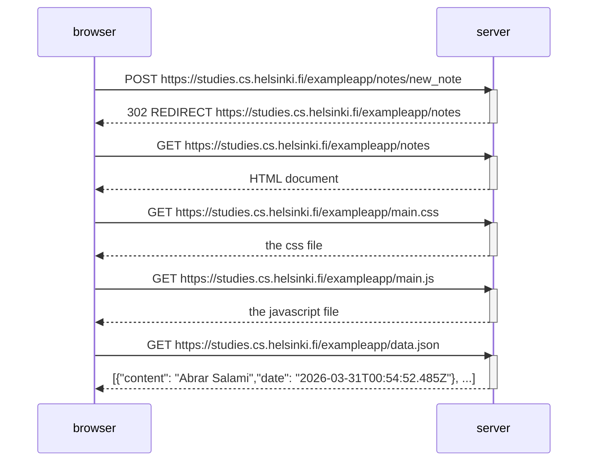

```mermaid
sequenceDiagram
    participant browser
    participant server

browser->>server: POST https://studies.cs.helsinki.fi/exampleapp/notes/new_note
activate server
server-->>browser: 302 REDIRECT https://studies.cs.helsinki.fi/exampleapp/notes
deactivate server

browser->>server: GET https://studies.cs.helsinki.fi/exampleapp/notes
activate server
server-->>browser: HTML document
deactivate server

browser->>server: GET https://studies.cs.helsinki.fi/exampleapp/main.css
activate server
server-->>browser: the css file
deactivate server

browser->>server: GET https://studies.cs.helsinki.fi/exampleapp/main.js
activate server
server-->>browser: the javascript file
deactivate server

browser->>server: GET https://studies.cs.helsinki.fi/exampleapp/data.json
activate server
server-->>browser: [{"content": "Abrar Salami","date": "2026-03-31T00:54:52.485Z"}, ...]
deactivate server
```
