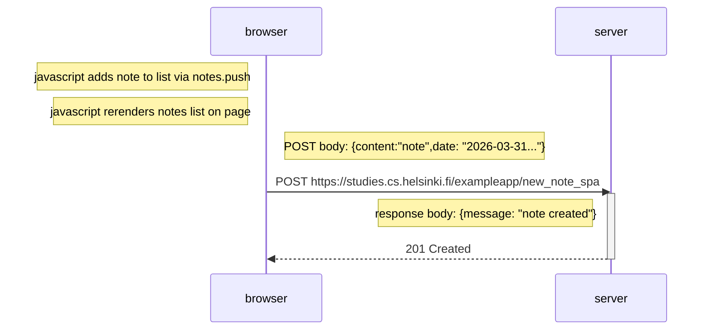

```mermaid
sequenceDiagram
    participant browser
    participant server
note left of browser: javascript adds note to list via notes.push
note left of browser: javascript rerenders notes list on page
Note right of browser: POST body: {content:"note",date: "2026-03-31..."}
browser->>server: POST https://studies.cs.helsinki.fi/exampleapp/new_note_spa
activate server
Note left of server: response body: {message: "note created"}
server-->>browser: 201 Created
deactivate server
```